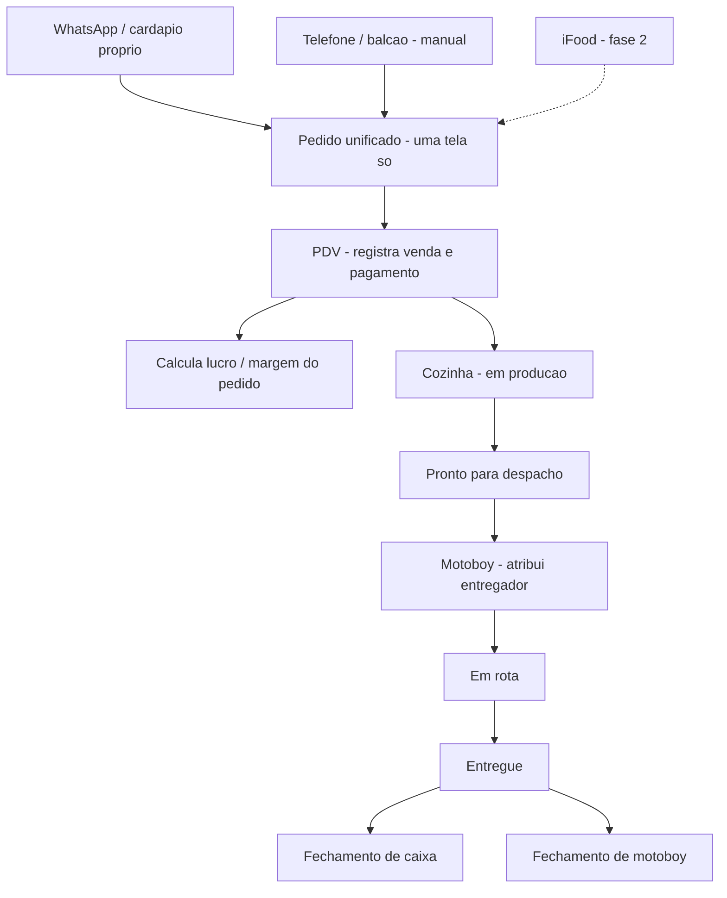

# Hub de gestão para pizzarias — fluxo inicial

> Sistema interno de operação para pizzarias. Um "TEKNISA simplificado": só a fatia
> operacional de frente + delivery. Sem backoffice pesado, sem fiscal (por enquanto).
> Vendido mensal, multi-cliente (multi-tenant).

---

## 1. Escopo do MVP

**Dentro (os 3 módulos + o "juntar"):**
- **Pedidos / tele-entrega** — recebe pedidos de vários canais numa tela só, com ciclo de status.
- **PDV + Lucro** — registra venda e pagamento, calcula margem/lucro por pedido, controla caixa (abertura, sangria, suprimento, fechamento).
- **Motoboy** — cadastro de entregadores, despacho, acompanhamento e **fechamento de motoboy** (a cunha — depende da planilha do cliente).

**Fora (agora):**
- Emissão fiscal (NFC-e / NF-e) → fase futura, via API (Focus NFe / PlugNotas).
- Ficha técnica completa / compras / estoque avançado / BI / RH.
- Vitrine pública para cliente final (arquivar, não é o foco).

**Fase 2 (depois do MVP rodando sólido em 1 pizzaria):**
- Integração iFood (Merchant-API + homologação).
- WhatsApp Business API.
- Canal próprio (o cardápio arquivado volta como input).

---

## 2. Fluxo do pedido

O princípio-chave: **os módulos são desacoplados.** Se o canal de entrada
(ex: iFood na fase 2) quebrar, o PDV e o motoboy continuam funcionando. Uma
falha nunca derruba tudo — isso é sobrevivência de dev solo.

---

## 3. Modelo de dados v0

Multi-tenant desde o dia zero: **um código, muitos clientes**. Cada registro
carrega `loja_id` (ou `tenant_id`). Nunca forkar o sistema por cliente.

- **Loja / Tenant** — id, nome, config (parametrização por cliente).
- **Usuario** — já existe: reaproveitar auth + roles (SUPER_ADMIN, ADMIN, GERENTE, ATENDENTE).
- **Produto** — id, loja_id, nome, preço, (custo? → ver pesquisa sobre lucro).
- **Pedido** — id, loja_id, canal (whatsapp/telefone/balcao/ifood), status, cliente_nome, endereço, total, forma_pagamento, criado_em.
- **ItemPedido** — pedido_id, produto_id, qtd, obs (meio a meio, borda, adicional).
- **Motoboy** — id, loja_id, nome, contato, regra_acerto (→ planilha).
- **Entrega** — pedido_id, motoboy_id, status (rota/entregue), taxa, saída_em, entregue_em.
- **Caixa** — id, loja_id, aberto_em, fechado_em, valor_abertura, valor_fechamento.
- **MovimentoCaixa** — caixa_id, tipo (venda/sangria/suprimento), valor, ref_pedido.

*(Rascunho — a planilha do motoboy provavelmente muda `Motoboy` e `Entrega`.)*

---

## 4. O que aproveitar do sistema atual

**Manter (a fundação cara):**
- Backend Express + Prisma + Postgres/Supabase.
- Auth: JWT HttpOnly, 2FA TOTP, bcrypt.
- RBAC / middleware de autorização, roles GERENTE/ATENDENTE.
- Audit log, scaffolding de admin.

**Arquivar (branch, não deletar de vez):**
- Vitrine do cliente final: cardápio público, carrinho localStorage, checkout.
- Motivo pra arquivar e não apagar: vira o "canal próprio" na fase 2, custo zero.

---

## 5. Ordem de construção

1. **Fundação** — reaproveitar backend/auth, ativar multi-tenant, entidades base (Loja, Usuario, Produto).
2. **Módulo Pedidos** (a espinha) — tela unificada + lançamento manual + ciclo de status.
3. **Módulo Motoboy** (a cunha — prioridade alta, é o diferencial) — despacho + fechamento.
4. **Módulo PDV + Caixa + Lucro** — registro de venda, pagamento, margem, sangria/fechamento.
5. **Fase 2** — iFood, WhatsApp Business API, fiscal (se um dia).

> Regra de ouro: deixar **1 pizzaria** rodando sólida antes de vender pra 5.
> Profundidade antes de largura.

---

## 6. Checklist de pesquisa (direcionada)

Não pesquisar tudo — só o que destrava decisão:

- [ ] **Motoboy / fechamento**: pegar a planilha do cliente. Entender o acerto — é taxa por entrega? por km? diária + por entrega? quem paga o quê? (fonte primária)
- [ ] **Lucro no PDV**: como ele calcula lucro hoje? Precisa de custo por produto ou uma margem simples resolve? (lembrar: é gerencial, não fiscal)
- [ ] **Fluxo atual de telefone/balcão**: como ele anota um pedido hoje? (pra desenhar o lançamento manual do jeito que ele já pensa)
- [ ] **Multi-tenant no Postgres/Prisma**: `tenant_id` por linha vs schema por tenant — qual padrão pro teu caso.
- [ ] **Referência de concorrentes no despacho/motoboy**: olhar como Saipos, ConnectPlug e Comanda10 fazem "fechamento de entregadores" — só pra ideia de feature, não pra copiar.
- [ ] **iFood (fase 2)**: portal do desenvolvedor, loja de teste, webhook de pedidos, critérios de homologação.

---

## 7. Pendências que bloqueiam design

- [ ] Planilha do fechamento de motoboy (bloqueia o Módulo 3).
- [ ] Nº real de lojas ativas do cliente (3? 4?).
- [ ] Modelo de lucro: margem fixa ou custo real por item?